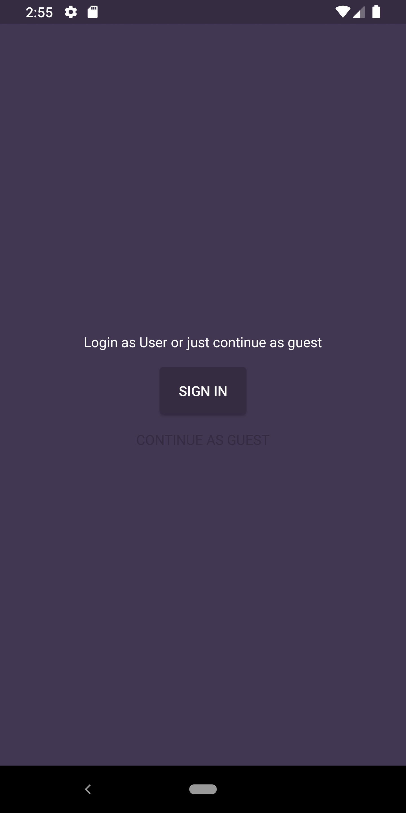
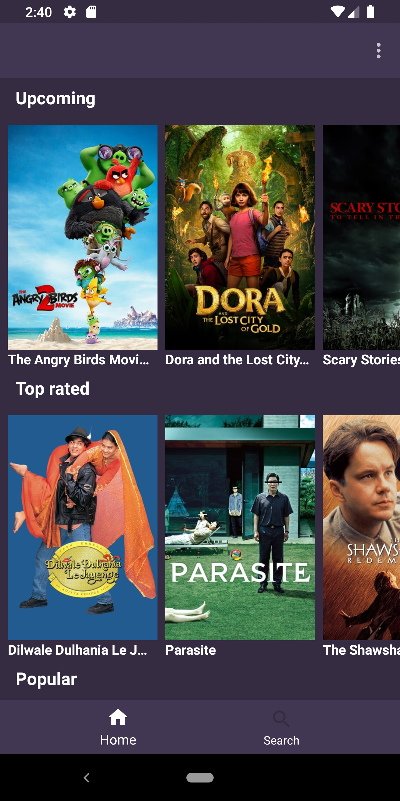
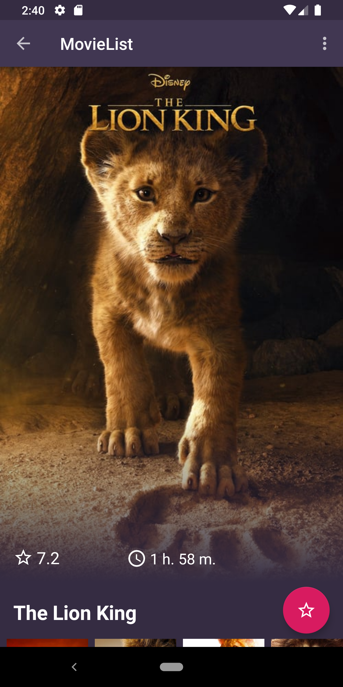
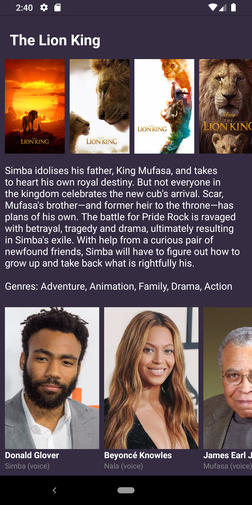
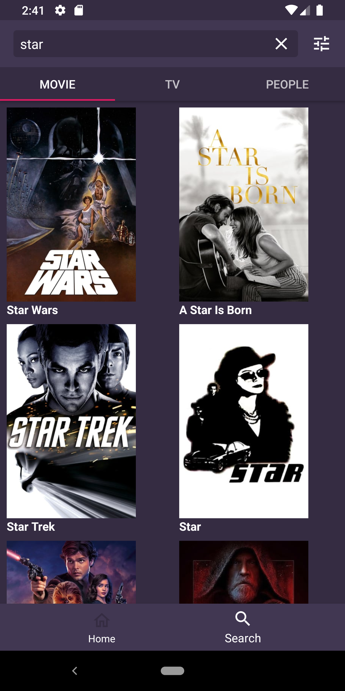

# MovieList
Movie List is an app where you can search and discover new movies.
Add them in your watchlist, rate and read information about your favorite movies.

## Screenshots
 
 
 

## Tools
The App is using [themoviedb](https://www.themoviedb.org) REST API
- [Retrofit](https://square.github.io/retrofit) to manage API requests.
- [Glide](https://bumptech.github.io/glide) to download images.
